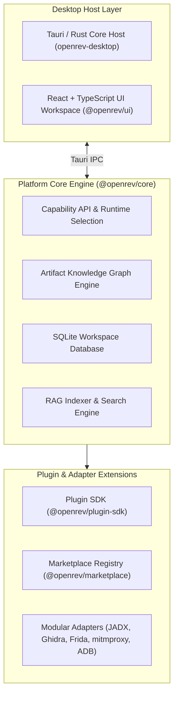

# OpenRev Platform Architecture Documentation

**OpenRev** is a cross-platform desktop software intelligence and reverse-engineering platform designed around generic software artifacts and capability-based tool orchestration.

> **Implementation-status note (0.1.0-alpha.1):** The **Core Engine** layers shown
> below — ZIP/AXML parsing, the Android provider, the analysis pipeline, SQLite
> workspace, search, adapters, CLI, and MCP server — are **real and tested**. The
> **Desktop Host Layer** (Tauri/UI) and the **AI Copilot / RAG** nodes are
> **experimental** and not part of the release gate. See
> [KNOWN_LIMITATIONS.md](KNOWN_LIMITATIONS.md) and
> [RELEASE_CRITERIA.md](RELEASE_CRITERIA.md).

---

## 🏛️ Monorepo & System Layers

---

## Key Design Principles

1. **Local-First & Offline Capable**: All database storage, indexing, and analysis run locally on the user's desktop using SQLite and embedded indexes.
2. **Capability-Based Tool Runtime**: Users express intentions (`Analyze APK`, `Extract Endpoints`, `Decompile Native SO`), and the engine selects the appropriate underlying adapters.
3. **Artifact Knowledge Graph**: Connected graph schema holding nodes (`APK`, `Manifest`, `Activity`, `Compose Screen`, `Layout`, `ApiEndpoint`, `Native SO`, `Permissions`, `Strings`) and directed relationships.
4. **Graph-Driven & RAG AI Copilot**: AI models (OpenAI, Anthropic, Ollama, vLLM, LM Studio) query the Knowledge Graph and indexed source chunks instead of repeatedly reading raw binaries.
5. **Extensible Plugin Marketplace**: Supports first-party and third-party plugins with independent versioning and sandboxed execution.
